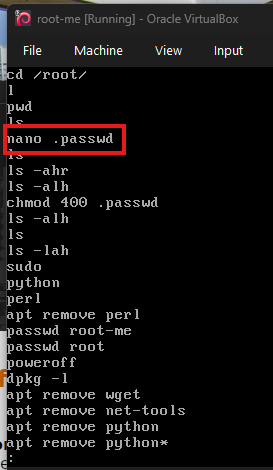

grub: https://www.gnu.org/software/grub/manual/grub/grub.html

- extraction du fichier, nous sommes en presence d'un .ova qui est une image virtual.
- ouverture de l'image dans un hyperviseur notamment virtualbox.
- nous sommes confronter a entrer les creddentials avant acces. pour bypasser, l'on va editer le grub pour demarrer en mode single-user (si GRUB n'est pas protégé).
- Démarre la VM, appuie sur **Esc**/**Shift** (ou la touche qui fait apparaître GRUB) pour éditer l’entrée de démarrage ou juste demarre la vm et voir parmi les options afficher dans le grub une qui permet d'editer, dans notre cas c'etait la touche "e".
- Sur la ligne commençant par `linux`/`linuxefi`, ajoute à la fin :
```
init=/bin/bash
```
ou
```
systemd.unit=rescue.target
```
puis enregistrer avec ctrl+X et demarrer.

- une fois sur le systeme nous devons chercher le flag. apres plusieurs grep et find dans le systeme sans rien trouver, l'on a pense regarder du cote de l'utilisateur (historique de commande)
```
less /root/.bash_history
```

- on constate des la 5eme ligne que le fichier .passwd a ete editer par l'utilisateur, on s'y rend afin de verifier le contenu.
```
cat /root/.password
```

voila donc notre flag:  F1aG-M3_PlEas3:)

- **other solution 1:**
On télécharge notre vm **root.ova**.  
Ensuite, on l’ouvre dans vmware, vous donnerez le nom que vous voulez à la machine lors de l’importation.

Une fois que c’est tout bon, on peut lancer la vm en **mode rescue de Grub**. Pour accéder au mode rescue de Grub, il suffit d’appuyer à la touche **ESC**. Puis on appuie sur la touche **c** pour ouvrir le mode ligne de commandes de Grub.
```
grub> ls   (hd0) (hd0,msdos5) (hd0, msdos1)
```

On peut voir nos différentes partitions disk.  
Il suffit maintenant de regarder dans chaque partition disk pour voir ce qu’il y a à l’intérieur
```
grub> ls (hd0, msdos1)/   
lost+found/ etc/ media/ vmlinuz var/ usr/ lib/ bin/ sbin/ sys/ run/ root/   proc/ home/ dev/ boot/ opt initrd.img
```

Enfin on peut utiliser la commande **cat** pour ouvrir un fichier.
```
grub> cat (hd0, msdos1)/root/.passwd   bravo voici le flag:   FlaG****3:)
```

- **other solution 2:**
Le fichier ova est en fait un tar comme nous l’indique file
```
file root.ova
```
root.ova: POSIX tar archive

Il contient deux fichiers :
```
tar xvf root.ova
```
- root.ovf est la description de la VM
- root-disk001.vmdk est l’image disque de la VM

On peut le monter sous linux avec l’outil `guestmount` disponible dans le paquet `libguestfs-tools` sous debian:
```
sudo apt install -y libguestfs-tools   
mkdir -p /mnt/root
sudo guestmount -a root-disk001.vmdk -i --ro /mnt/root
sudo ls -al /mnt/root/root
```

- **other solution 3:**
Import du fichier OVA dans VirtualBox.
   
Ouverture du disque VM `root-disk001.vdi` créé à l’import de celle-ci avec Notepad++.
   
Recherche de mots-clés (`password`, `root`, `rootme`) dans le fichier brut.
   
Localisation du contenu de `/etc/passwd` et récupération du hash SHA-512 du compte `root` (format `$6$salt$hash`).

utilisation d'outil en ligne pour la Génération d’un hash SHA-512 Unix pour le mot de passe `root` (format `$6$salt$nouveau_hash`).

Remplacement du hash original par le nouveau dans le fichier `root-disk001.vdi`.
   
Démarrage de la VM et connexion en `root` avec le mot de passe `root`.
   
Découverte du fichier `/root/.passwd` contenant le flag.

- **other solution 4:**
Extraction du sample
```
unzip ch33.zip
tar -xvf root.ova
```
Utilisation de guestfish (en root)
```
1. # décommenter pour voir comment ça fonctionne
2. # export LIBGUESTFS_DEBUG=1 LIBGUESTFS_TRACE=1
3. guestfish
4. add-ro root-disk001.vmdk
5. list-filesystems
6. mount /dev/sda1 /
```
