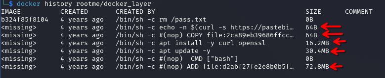
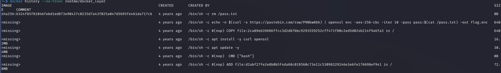
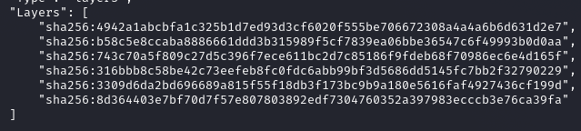
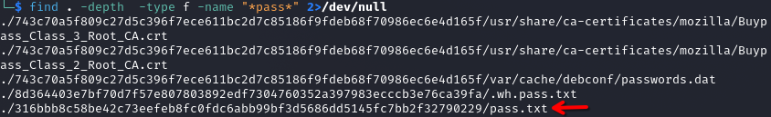

help link: https://kodekloud.com/blog/docker-image-layers/

- extraction du fichier ch29.tar.
- on constate on contenu tres verbeux avec d'autre .tar , des dossiers , des fichiers json et autre. apres quelques recherche et fouille dans les dossier, on se rend compte que c'est la sauvegarde d'une image docker.
- Importer l’image dans Docker
```
docker load -i ch29.tar
```

- Vérifier que l’image est bien là
```
docker images
```

- Lancer un conteneur interactif
```
docker run -it rootme/docker_layer bash
```

- contenu du container
apres quelque find et recherche dans le container on constate la presence de "flag.enc" (spoileur: c'est le flag chiffre).

- investigation sur l'image
pour trouver le bon flag, l'on a mener des investigations sur l'image avec:
```
docker history rootme/docker_layer
```

on vois bien les 5 couches qui constitue l'image

pour avoir une sortie plus lisible on ferra
```
docker history --no-trunc rootme/docker_layer
```

on peut confirmer les layers avec:
```
docker inspect rootme/docker_layer
```


Au vue des precedentes images on peut voir la suppression d'un fichier pass.txt et une commande de chiffrement qui a pour sortie flag.enc (notre flag chiffre). On cherchera donc a trouver dans les couches de l'image le fichier pass.txt.
faut retenir que l extraction de ch29.tar donc plein de truc comme il a ete signifier plus haut dans lesquelles le fichiers peut se trouver puisse que sur le container ya que flag.enc.

- recherche du fichier pass:
```
find . -depth  -type f -name "*pass*" 2>/dev/null
```


- contenu du fichier pass.txt:
```
cat ./316bbb8c58be42c73eefeb8fc0fdc6abb99bf3d5686dd5145fc7bb2f32790229/pass.txt
```

	d4428185a6202a1c5806d7cf4a0bb738a05c03573316fe18ba4eb5a21a1bc8ea

- comme signifier plus haut, il y a eu utilisation de openssl pour chiffrer. on va donc l'utiliser pour dechiffrer avant ca copie de flag.enc depuis le container
```
docker cp wonderful_burnell:/flag.enc .
```

- dechiffrement de flag.enc
```
openssl enc -aes-256-cbc -d -iter 10 -in flag.enc -out flag.txt -pass pass:d4428185a6202a1c5806d7cf4a0bb738a05c03573316fe18ba4eb5a21a1bc8ea
```

- affichage du flag 
```
cat flag.txt
```
et voila le flag (c'etait pas simple): Well_D0ne_D0ckER_L@y3rs_Inspect0R 

- **other solutions:**
To analyze a Docker image simply run dive with an image tag/id/digest:
```
alias dive="docker run -ti --rm  -v /var/run/docker.sock:/var/run/docker.sock docker.io/wagoodman/dive"
dive <your-image-tag>

# for example
dive nginx:latest
```

